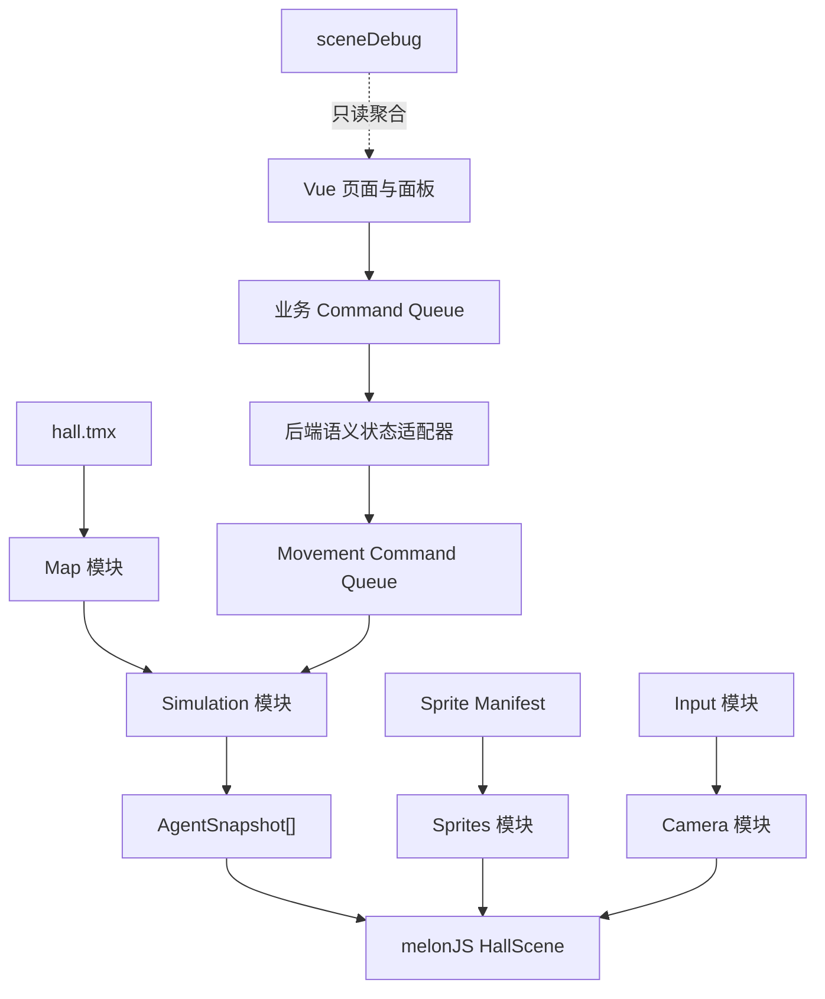
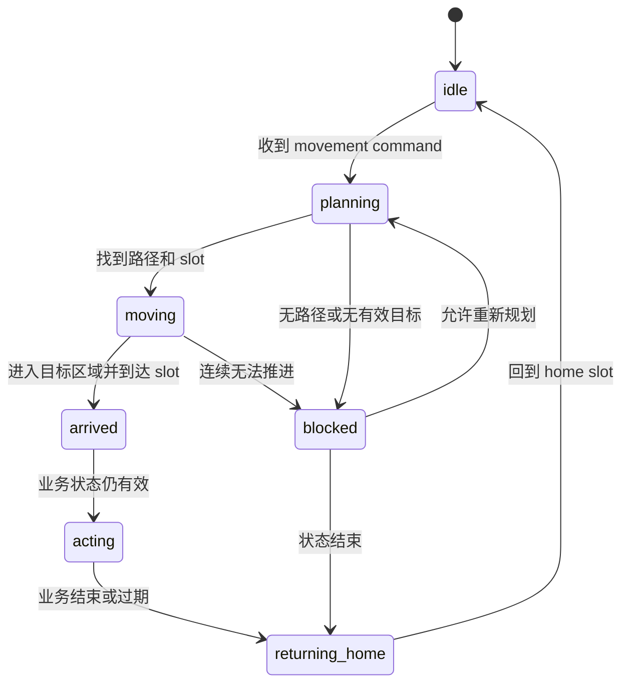

# 聚义厅地图交互与 Agent 仿真统一设计

日期：2026-07-11
状态：已确认，作为后续实施的唯一主规格

> 本文取代以下设计，旧文仅保留历史追溯用途：
>
> - `docs/superpowers/specs/2026-07-09-juyiting-mobile-map-interaction-design.md`
> - `docs/superpowers/specs/2026-07-10-juyiting-interaction-and-npc-simulation-design.md`

## 1. 背景与定位

聚义厅已经从单页业务入口演进成地图优先的协作大厅。页面需要同时承担移动端地图交互、横竖屏兼容、业务面板、Agent 状态展示、人物移动反馈、未来多人仿真和可测试的场景调试能力。

本规格统一定义：

- 手机、平板和 PC 的地图交互。
- 横竖屏、软键盘和面板期间的行为。
- TMX 内容、路网、热点和站位的数据规范。
- 人物精灵图和 manifest 标准。
- Agent/NPC 移动仿真。
- 后端语义状态、REST 快照、SSE 增量和 phase 回报。
- 模块边界、初始化、错误处理、测试和分阶段上线。

采用“地图核心 + 可插拔仿真”的架构，并按可运行纵向闭环推进，不一次性重写整个聚义厅。

## 2. 核心原则

1. 聚义厅是 map-first app。
2. 地图位置只由用户手势和“回主厅”改变，不由 resize、软键盘、面板或人物状态改变。
3. 后端决定人物的业务语义，前端决定路径、位置、碰撞和动画。
4. 人物移动是业务反馈，不是业务成功条件；业务接口成功后立即返回成功。
5. 同一聚义厅场景内允许跨区域移动，当前不支持跨场景移动。
6. 地图核心不依赖业务接口和人物资源才能显示。
7. 仿真、人物资源和业务数据失败尽可能局部降级；基础地图和 movement 核心失败才使整页不可用。
8. `public/juyiting/hall.tmx` 是地图、热点和 movement 数据的唯一事实源。
9. 后端不持久化精确坐标、路径或帧级进度。
10. 复杂纯逻辑优先使用 TypeScript，Vue 组件与现有 composables 保持 JavaScript。
11. 模块必须边界清晰、可替换、可独立测试。
12. 每个实施阶段都必须具备对应自动化验收入口。

## 3. 交付范围

### 3.1 第一阶段：纵向闭环 MVP

第一阶段交付：

- 手机和 PC 默认视图。
- 拖动、焦点缩放和边界限制。
- 横竖屏保持关注点。
- 软键盘不重置地图。
- 分终端面板布局和地图交互锁定。
- Camera、Input、Map 基础模块化。
- TMX movement schema、`stableId`、`regionId` 和 validator。
- snapshot、clean preview 和 debug preview。
- 宋江正式 spritesheet、manifest 和资源校验。
- 单人物 A*、home slot 和 parking slot。
- REST 全量快照与 SSE 增量同步。
- 基于时间重建刷新后的移动进度。
- `arrived` / `blocked` 回报。
- 统一 `sceneDebug`。
- 单元测试、集成测试和 UI smoke。

### 3.2 第二阶段：多人仿真

第二阶段交付：

- 宋江、吴用、林冲、卢俊义、扈三娘、李逵六名核心人物正式资源。
- 同屏最多 24 人，同时移动最多 12 人。
- parking / queue slot 分配。
- 严格碰撞与通道宽度。
- 多人分批出发。
- 优先级让路。
- 阻塞检测和最多三次 replan。
- 等待气泡和状态表现。
- 基准中端安卓设备稳态不低于 30 FPS。

### 3.3 非目标

当前规格不包含：

- 跨场景人物移动。
- 用户点地移动、拖拽人物或直接调度人物。
- 完整 navmesh。
- 后端持久化精确坐标、路径或帧级进度。
- 多客户端逐帧同步。
- 108 人同时移动。
- 通过关闭碰撞或允许穿透进行性能降级。
- 人物移动音效。
- 非聚义厅页面重构。
- 未经风格评审就批量生成最终人物资源。

## 4. 总体架构



### 4.1 Vue 组件层

位置：`src/components/juyiting/`

职责：

- 页面布局。
- 普通面板、聊天面板和人物卡片。
- loading、error、retry。
- 接收并发出用户操作事件。
- 根据终端类型选择面板形态。

禁止：

- 计算路径。
- 修改人物坐标。
- 直接控制碰撞或仿真。
- 直接解析 TMX。
- 直接访问 melonJS 内部对象。

### 4.2 Composables 业务层

位置：`src/composables/juyiting/`

新增：

```text
useHallPanels.js
useHallDrafts.js
useHallCommandQueue.js
useHallBackendSceneState.js
useHallSceneState.js
```

职责：

- 业务数据加载。
- REST 快照和 SSE 生命周期。
- 面板与草稿状态。
- 将后端语义状态转换为业务 command。
- 回报 `arrived` / `blocked`。
- 处理事件去重、版本断档和重新同步。

业务层知道 `taskId`、`discussionId`、`agentId`，但不知道路径节点和人物坐标。

### 4.3 Camera

位置：`src/game/camera/`

```text
cameraController.ts
cameraTransform.ts
viewPresets.ts
resizePolicy.ts
```

职责：

- zoom、offset、clamp。
- 围绕焦点缩放。
- 默认主厅视图。
- 横竖屏保持 world point。
- “回主厅”动画。
- 软键盘 resize 过滤。

Camera 不处理人物、热点和面板业务。

### 4.4 Input

位置：`src/game/input/`

```text
pointerGesture.ts
inputController.ts
hitTest.ts
interactionLock.ts
```

职责：

- click、drag、pinch、wheel 和 keyboard 判定。
- touch / mouse 阈值。
- 人物、热点和空白的命中优先级。
- 面板打开时统一锁定地图。
- 手势取消和事件清理。

### 4.5 Map

位置：`src/game/map/`

```text
tmxMovementParser.ts
movementSchema.ts
mapValidation.ts
tmxEditOps.ts
tmxSnapshot.ts
tmxPreviewRenderer.ts
```

职责：

- 解析 TMX。
- 校验地图和 movement 数据。
- 输出标准化 `MapRuntimeData`。
- 生成 snapshot 和 clean/debug preview。
- 不管理正在移动的人物。

### 4.6 Simulation

位置：`src/game/simulation/`

第一阶段：

```text
movementEngine.ts
movementCommandQueue.ts
graphPathfinder.ts
slotAllocator.ts
backendSceneStateAdapter.ts
```

第二阶段：

```text
collisionWorld.ts
reservationSystem.ts
behaviorQueue.ts
replanPolicy.ts
```

职责：

- 将 movement command 转换为路径和行为。
- 管理人物位置、速度和动画状态。
- 输出只读 `AgentSnapshot[]`。
- 生成 `arrived` / `blocked` phase event。
- 不调用具体业务接口。

### 4.7 Sprites

位置：`src/game/sprites/`

```text
personaSpriteManifest.ts
spriteValidation.ts
spriteLoader.ts
animationResolver.ts
```

职责：

- persona 与 spritesheet 映射。
- 动画 fallback。
- anchor、collider 和 scale。
- required / optional 资源校验。
- 禁止使用默认角色冒充缺失 persona。

### 4.8 Debug

位置：`src/game/debug/`

```text
sceneDebugAggregator.ts
sceneDebugTypes.ts
```

职责：

- 聚合只读场景状态。
- 为 UI smoke 和真机排查提供稳定接口。
- 不修改业务、地图或仿真状态。

### 4.9 初始化顺序

1. 页面挂载并启动地图。
2. 加载、解析和校验 TMX。
3. 地图基础层 ready。
4. 初始化 Camera 和 Input。
5. 加载并校验 sprite manifest。
6. 初始化 Simulation。
7. 并行拉取 REST 场景快照、Agent 和业务数据。
8. 将业务结果写入 pending buffer。
9. Map 与 Simulation ready 后应用快照。
10. 建立 SSE 连接。
11. 输出 `AgentSnapshot[]` 并渲染人物。
12. 暴露只读 `sceneDebug`。
13. SSE 重连时按版本增量续传或重新获取快照。

## 5. 前后端场景契约

### 5.1 接口边界

现有接口继续保留：

```http
GET /agent/map
```

它兼容当前在线人物列表，但不再承担完整场景状态同步。

新增：

```http
GET  /agent/scenes/{sceneId}/snapshot
GET  /agent/scenes/{sceneId}/events
POST /agent/scenes/{sceneId}/phases
```

第一版固定：

```text
sceneId = juyiting-main
```

所有场景接口必须沿用当前登录用户和 `clientId` 租户范围；客户端不能读取或回报其他租户的场景状态。需要携带授权请求头时，SSE 使用现有 `useHttp` 的 fetch streaming 能力，不依赖无法自定义请求头的原生 `EventSource`。

### 5.2 场景快照

```http
GET /agent/scenes/juyiting-main/snapshot
```

示例：

```json
{
  "sceneId": "juyiting-main",
  "sceneVersion": 128,
  "generatedAt": "2026-07-11T10:00:00+08:00",
  "agents": [
    {
      "agentId": "agent-songjiang",
      "personaCode": "songjiang",
      "status": "online"
    }
  ],
  "states": [
    {
      "agentId": "agent-songjiang",
      "personaCode": "songjiang",
      "behavior": "moving_to_discussion",
      "originRegionId": "main-seat",
      "targetRegionId": "council-table",
      "relatedType": "discussion",
      "relatedId": "discussion-123",
      "phase": "moving",
      "stateVersion": 16,
      "startedAt": "2026-07-11T09:59:50+08:00",
      "expectedArrivalAt": "2026-07-11T10:00:10+08:00",
      "expiresAt": "2026-07-11T10:05:00+08:00"
    }
  ]
}
```

规则：

- `sceneVersion` 是整个场景事件流单调递增版本。
- `stateVersion` 是单个人物状态的单调递增版本。
- 同一人物在同一场景中最多有一个当前主状态。
- 同一 persona 同时最多绑定一个真实 Agent。
- 后端不保存路径、坐标、动画帧或碰撞状态。

### 5.3 SSE 增量同步

```http
GET /agent/scenes/juyiting-main/events?sinceVersion=128
Accept: text/event-stream
```

示例：

```text
id: 129
event: agent-scene-state-updated
data: {"sceneVersion":129,"state":{"agentId":"agent-songjiang","stateVersion":17,"behavior":"returning_home","targetRegionId":"main-seat"}}
```

规则：

- 客户端只接受更新版本。
- 重复事件直接忽略。
- 版本断档时停止应用增量并重新获取 snapshot。
- 页面从后台恢复时检查版本。
- SSE 重连携带 `sinceVersion`。
- 服务端无法续传时要求客户端重新拉取快照。
- SSE 只传场景语义状态，不传聊天内容和精确坐标。
- 浏览器场景 SSE 与现有 Agent WebSocket 分开维护。

### 5.4 Phase 回报

```http
POST /agent/scenes/juyiting-main/phases
```

请求：

```json
{
  "reportId": "01J2ABCDEF",
  "agentId": "agent-songjiang",
  "stateVersion": 17,
  "phase": "arrived",
  "regionId": "main-seat",
  "occurredAt": "2026-07-11T10:00:08+08:00"
}
```

第一版 `phase` 只允许：

```text
arrived
blocked
```

服务端规则：

- `reportId` 用于幂等。
- 状态版本过期返回 `ignored_stale`。
- 重复报告返回 `ignored_duplicate`。
- 有效报告返回 `accepted`。
- phase 不能覆盖更新的业务主状态。
- 回报失败不影响前端动画。
- 前端最多重试两次，退避间隔固定为 1 秒、3 秒；之后仅记录 warning，等待下一次状态更新。

### 5.5 ID 规范

后端业务契约使用：

```text
sceneId
regionId
agentId
personaCode
relatedType
relatedId
```

这些业务 ID 使用 kebab-case，例如：

```text
juyiting-main
council-table
bounty-board
songjiang
```

TMX region 对象同时保存：

```text
stableId: region-council-table-v1
regionId: council-table
```

- `stableId` 用于编辑、审计、snapshot 和 ops 定位。
- `regionId` 用于前后端业务契约。
- 重建 TMX 对象时可以修改 stableId，但必须保留业务 regionId。
- validator 保证 regionId 唯一并至少存在一个可达 slot。

### 5.6 Movement command

```ts
type MovementCommand = {
  commandId: string
  agentId: string
  personaCode: string
  source: 'backend' | 'local' | 'user'
  type: 'MOVE_TO_REGION' | 'RETURN_HOME'
  targetRegionId: string
  priority: number
  stateVersion: number
  startedAt: string
  expectedArrivalAt?: string
  expiresAt?: string
}
```

第一版只产生 `backend` 和 `local`。`user` 仅保留类型，不开放用户调度入口。

### 5.7 刷新和重连恢复

收到快照后：

1. 根据 persona 查找 home slot。
2. 根据 `originRegionId` 和 `targetRegionId` 计算当前路径。
3. 使用 `startedAt` 与 `expectedArrivalAt` 计算归一化进度。
4. 将人物放到路径上的估算位置。
5. 尚未到达则继续移动。
6. 已超过预计到达时间则放到目标 slot。
7. 状态过期或业务结束则生成 `RETURN_HOME`。
8. 当前 TMX 不存在对应 regionId 时进入 `blocked`，不瞬移、不使用任意区域替代。

不同客户端只保证业务状态一致，不保证估算位置和局部避让逐帧一致。

### 5.8 后端分层

后端能力继续遵守现有 Agent 模块分层：

- `jia-agent-api`：场景状态 Service 接口和对外契约。
- `jia-agent-core`：scene state、event、phase DTO、Entity、常量和错误码。
- `jia-agent-service`：Controller、业务状态适配、SSE broker、幂等与版本控制。
- `jia-agent-mapper`：场景状态、事件版本和 phase report 的 DAO、Mapper 与 SQL。

业务任务、议事和查卷流程通过领域服务写入语义状态，不允许 Controller 直接拼装或修改场景状态。

### 5.9 状态优先级

从高到低：

1. 更新版本的后端业务状态。
2. 已 committed 的当前业务移动。
3. 返回 home。
4. 巡逻。
5. idle 微动作。

更新的后端状态永远优先，但不能使人物瞬移。已经进入目标区域或距离已分配 slot 小于阈值的动作视为 committed，先完成当前到达过程，再应用新命令。

## 6. TMX 内容管线

### 6.1 唯一事实源

`public/juyiting/hall.tmx` 负责：

- 地图图层。
- 遮挡和灯光。
- 热点。
- 可行走区域和障碍。
- 路网。
- 业务区域。
- 停靠位、等待位和默认岗位。

Snapshot、preview 和 edit ops 都是派生产物，不参与运行。

### 6.2 地图版本

TMX map properties 必须包含：

```text
movementSchemaVersion: "1"
navGraphVersion: "juyiting-main-v1"
spriteManifestVersion: "persona-sheets-v1"
sceneId: "juyiting-main"
```

规则：

- 不支持的 movement schema 为 fatal。
- 路网版本进入 debug state 和 snapshot。
- sprite manifest 版本不匹配时阻断构建；线上人物模块降级并重试。
- 路网升级不迁移后端状态。

### 6.3 图层规范

长期统一为英文 snake_case：

```text
background
props
mid_occluders
foreground_occluders
lighting_overlay
collision
mask
hotspots
nav_area
nav_obstacles
regions
nav_nodes
nav_edges
parking_slots
queue_slots
home_slots
debug_labels
```

现有短横线旧名称暂时兼容，新增图层不得继续使用旧命名。批量改名必须通过 edit ops。

### 6.4 坐标

TMX 只保存原生像素坐标：

```text
地图：1664 × 928
tile：16 × 16
grid：104 × 58
```

禁止将百分比写回 TMX。运行时可以派生 world、归一化、viewport 和调试百分比坐标。

人物站位、碰撞、排序和路径以脚底 world point 为准。

### 6.5 Region

```text
stableId: region-council-table-v1
regionId: council-table
label: 议事区
capacity: 6
protected: true
riskLevel: high
```

- 支持 polygon、rectangle、ellipse。
- 运行时统一转 polygon。
- `regionId` 全场景唯一。

### 6.6 Nav node

```text
stableId: node-main-junction-01
kind: junction
channelWidth: 72
```

- Tiled 椭圆中心为节点坐标。
- `kind`：`normal`、`junction`、`doorway`、`narrow`。

### 6.7 Nav edge

```text
stableId: edge-main-to-council-01
from: node-main-junction-01
to: node-council-entry-01
bidirectional: true
costMultiplier: 1.0
```

- polyline 用于可视化。
- `from` / `to` 是运行时权威引用。
- 第一版一条 edge 只连接两个节点。
- validator 检查 polyline 端点是否接近对应 node。

### 6.8 Parking / queue slot

```text
stableId: slot-council-parking-01
regionId: council-table
priority: 1
capacity: 1
facing: left
radiusX: 18
radiusY: 10
```

- 椭圆中心表示脚底站位。
- 第一版每个 slot 容量固定为 1。
- parking 满后使用 queue。
- queue 满后人物保持原地并进入 waiting / blocked。

### 6.9 Home slot

```text
stableId: home-songjiang
personaCode: songjiang
regionId: main-seat
priority: 1
facing: right
radiusX: 18
radiusY: 10
```

同一 persona 只能有一个有效 home slot。

### 6.10 Hotspot

```text
stableId: hotspot-bounty-board-v1
hotspotId: bounty-board
panel: tasks
regionId: bounty-board
label: 悬赏榜
priority: 10
hitSlopTouch: 12
```

`panel` 只允许：

```text
chat
agents
tasks
catalog
library
```

hotspot 不要求位于 nav_area。

### 6.11 修改方式

小改允许 direct patch：

- 单个对象属性或少量坐标。
- hotspot label / panel。
- opacity / tint。
- 图片 source。
- 少量 node、edge 或 slot。
- stableId 和 typo。

大改必须使用 edit ops：

- 重建路网。
- 批量增删节点。
- 重排 slot。
- 替换 object layer。
- 批量迁移属性。
- 大片修改 tile data。
- 修改 tileset。
- 升级 schema。
- 修改 protected 对象或大量资源引用。

审计位置：`docs/juyiting/tmx-ops/`

大改记录必须包含修改原因、影响对象、资源变化、before/after snapshot diff、校验结果和 clean/debug preview。

### 6.12 派生产物

统一由脚本生成：

```text
docs/juyiting/tmx-snapshots/hall.snapshot.json
docs/juyiting/tmx-snapshots/hall-preview-clean.png
docs/juyiting/tmx-snapshots/hall-preview-debug.png
```

Debug preview 叠加 region、nav node/edge、slot、obstacle、hotspot、stableId/regionId 和 risk 信息。禁止手工修改派生产物。

## 7. 人物精灵资源

### 7.1 资源策略

旧统一 atlas：

`public/juyiting/liangshan-character-walksheet-v1.png`

在新标准实施后不再作为运行依赖。新标准：

- 每个 persona 独立 spritesheet。
- 不兼容旧 atlas 行号映射。
- 不允许缺图角色使用默认人物冒充。
- 最终人物必须使用完整美术资产，不能使用 CSS 几何人物。
- 第一阶段只要求宋江正式资源。
- 第二阶段扩展其余五名核心角色。

目录：

```text
public/juyiting/sprites/personas/
  songjiang-v1.png
  wuyong-v1.png
  linchong-v1.png
  lujunyi-v1.png
  husanniang-v1.png
  likui-v1.png
```

### 7.2 美术风格门禁

批量制作前必须：

1. 制作宋江 2–3 套风格样片。
2. 在真实聚义厅地图中按目标尺寸预览。
3. 检查单人、多人、面板背景和移动状态。
4. 人工确认唯一标准风格。
5. 记录风格、色板、光向、透视和细节等级。
6. 只有通过评审的风格才能批量生成其他角色。

未通过评审的资源必须标记 `placeholder: true`，不得作为最终交付或生产发布依据。

### 7.3 Spritesheet

```text
frameWidth: 192
frameHeight: 224
columns: 8
```

基础 sheet：

```text
8 columns × 4 rows = 1536 × 896
```

强制动作行：

```text
row 0: idle
row 1: walk
row 2: talk
row 3: busy
```

扩展动作：

```text
wait
blocked
command
discuss
search
celebrate
special
```

第一版只支持左右朝向，使用 `flipX`，不制作四方向或八方向资源。

### 7.4 动画 fallback

```text
wait     -> idle
blocked  -> wait -> idle
discuss  -> talk
search   -> busy
command  -> busy
```

禁止 fallback 到其他 persona。

### 7.5 Sprite manifest

位置：`src/game/sprites/personaSpriteManifest.ts`

```ts
type PersonaSpriteManifest = {
  version: 'persona-sheets-v1'
  frameWidth: 192
  frameHeight: 224
  columns: 8
  personas: Record<string, {
    required: boolean
    placeholder: boolean
    image: string
    rows: number
    scale: number
    anchor: { x: number; y: number }
    collider: { radiusX: number; radiusY: number }
    baseSpeed: number
    defaultFacing: 'left' | 'right'
    animations: Record<string, {
      row: number
      frames: number[]
      frameDurationMs: number
      loop: boolean
    }>
  }>
}
```

第一阶段 `songjiang.required = true`。第二阶段其余五名角色在资源完成时逐一设为 required，不提前批量设为 required。

### 7.6 脚底坐标体系

- sprite anchor：脚底中心。
- depth sort：脚底 y。
- 路径位置：脚底 world point。
- collider：脚底椭圆或 capsule。
- 点击命中：渲染位置加 collider / hit slop。
- 高亮圈：围绕脚底。
- 姓名牌和气泡：根据视觉高度向上偏移。

头饰、兵器和衣摆不进入移动碰撞体。

### 7.7 生成记录

记录位置：`docs/juyiting/sprite-prompts/`

每个角色记录：

- persona 特征和用途。
- 已确认风格。
- spritesheet 规格。
- 正向和 negative prompt。
- seed、模型和工具信息。
- anchor、collider 和 scale。
- 人工 review notes。
- known issues。
- 资源版本和替换历史。

### 7.8 人工与自动验收

人工检查：

- persona 特征。
- 帧间抖动和服装一致性。
- 左右翻转。
- 裁切问题。
- 身高比例。
- 脚底、高亮圈、气泡和姓名牌。
- 多人辨识度。
- 地图缩放后的轮廓。
- 生成瑕疵。

自动检查：

- 文件存在并可加载。
- 图片宽度等于 `columns × 192`。
- 图片高度等于 `rows × 224`。
- 动画帧不越界。
- 四个核心动作存在。
- anchor 位于单帧范围内。
- collider 半径为正。
- scale 在允许范围内。
- required 缺失时预检失败。
- placeholder 不能通过生产预检。
- optional 缺失只 warning。
- 运行时不创建错误 persona 的替代角色。

## 8. 人物仿真

### 8.1 第一阶段

第一阶段只实现宋江单人物闭环：

- 从 home slot 出发。
- 沿 TMX 路网 A* 移动。
- 到达目标 region 的 parking slot。
- 播放对应业务动画。
- 回报 `arrived`。
- 业务结束后返回 home。
- 目标不可达时回报 `blocked`。
- 刷新或重连后按时间重建进度。

第一阶段不实现多人碰撞系统。

### 8.2 状态机

```text
idle
planning
moving
waiting
arrived
acting
returning_home
blocked
```



### 8.3 Command queue

优先级：

1. 点将、议事、查卷等后端业务命令。
2. 返回 home。
3. 本地巡逻。
4. idle 微动作。

规则：

- 巡逻和 idle 可被业务命令打断。
- 未 committed 的旧业务命令可被更新版本覆盖。
- committed 动作先完成当前到达过程，再处理新命令。
- 旧 `stateVersion` 直接丢弃。
- 同一人物同时只有一条 active movement command。

### 8.4 路径规划

第一版使用 TMX 路网 A*：

- 沿 `nav_nodes` / `nav_edges` 跨区域移动。
- 起点和终点投影到最近可达节点。
- edge cost 由距离和 `costMultiplier` 决定。
- 不穿过 `nav_obstacles`。
- 通道宽度小于人物 collider 时 edge 不可用。
- 局部平滑不能穿越障碍。
- PathFinder 接口保持可替换，未来可以改为 navmesh。

### 8.5 Slot 分配

1. 选择目标 region 空闲 parking slot。
2. parking 满后使用 queue slot。
3. queue 也满时保持原地等待。
4. queue 满时每 2 秒重新检查一次，连续三次仍无可用 slot 后进入 blocked。

选择规则：

- `priority` 数字越小越优先。
- 同优先级选择路径成本最低的 slot。
- slot 必须 reserve。
- 离开后释放 reservation。
- 已占用或预留的 slot 不可分配。

第一阶段只有一个人物，但接口按多人预留。

### 8.6 第二阶段多人移动

- 不允许全员同帧启动。
- 按 150–350ms 间隔分批出发。
- 核心业务人物优先。
- 同向移动时后方减速或等待。
- 对向或交叉移动按优先级让路。
- 人物不能互相穿透。
- 业务移动优先于返回 home、巡逻和 idle。
- 低优先级人物可退回等待点重新规划。

### 8.7 阻塞和重规划

第一版默认阈值集中放入 simulation 配置，不能散落硬编码：

```text
noProgressDurationMs: 1500
minimumProgressWorldPx: 4
slotWaitBeforeReplanMs: 2000
maxConsecutiveReplans: 3
```

阻塞信号：

- 连续 1.5 秒内目标距离减少不足 4 world px。
- 实际速度持续接近零。
- 下一通道长期被占用。
- reservation 失效。
- 等待超过 2 秒。

处理顺序：

1. 短暂等待。
2. 检查 reservation。
3. 重新计算路径。
4. 最多连续 replan 三次。
5. 仍失败则进入 blocked。
6. 回报后端但不无限重试。

### 8.8 速度与动画

```text
actualSpeed = personaBaseSpeed × behaviorMultiplier × pathModifier
```

- 巡逻慢。
- 业务接令快。
- 议事中等。
- 返回 home 中等偏慢。
- 排队和避让时减速或停止。
- 移动播放 `walk`。
- 停止播放 `idle` 或业务动作。
- 移动速度影响 walk 播放频率。
- 不做精确步幅同步、斜向专用动画和原地转身动画。

### 8.9 仿真与镜头

- 拖动和缩放地图时仿真继续。
- 横竖屏切换取消当前手势但不暂停仿真。
- 面板打开时地图输入锁定，人物仿真和动画继续。
- 点击移动人物只更新选中状态。
- 镜头不自动跟随人物。
- 到达时不弹额外 toast，只使用状态、动画或气泡表达。

### 8.10 性能预算

第二阶段：

```text
最大可见人物：24
最大同时移动：12
目标帧率：基准中端安卓设备稳态不低于 30 FPS
仿真更新：10–15 Hz
渲染：requestAnimationFrame 插值
单人物连续 replan：最多 3 次
```

基准中端安卓设备定义：

- Android 13 或以上。
- 6 GB RAM 或以上。
- 骁龙 778G、天玑 1080 或同级处理器。
- 1080p 级屏幕。
- 使用项目验收时支持的稳定版 Chrome。
- 验收报告必须记录设备型号、系统版本、浏览器版本和测试场景。

约束：

- 碰撞使用空间分区，不做全量两两检测。
- 只对移动人物和邻近人物高频检测。
- idle 人物以 2–5 Hz 更新。
- 路径规划分帧执行，同一渲染帧最多启动 2 次 A*。
- debug overlay 默认关闭。
- 超出同时移动上限的命令进入队列。
- 不关闭碰撞、不允许穿透来换取帧率。

## 9. 地图交互

### 9.1 终端优先级

1. 安卓 Chrome。
2. 安卓微信浏览器。
3. iPhone Safari。
4. iOS 微信浏览器。
5. PC Chrome / Edge。

手机触控优先，PC 输入复用同一套 Camera transform。

### 9.2 默认视图

默认主厅焦点配置为地图原生坐标 `(832, 390)`，等价于全图约 `(50%, 42%)`。所有数值统一放入 `viewPresets` 配置，不散落在组件和场景代码中。

首次进入或点击“回主厅”时：

- 手机竖屏聚焦忠义堂中部，默认 zoom 为 1.25。
- 手机横屏仍聚焦主厅，默认 zoom 为 1.05，并显示更多左右区域。
- 平板横屏接近 PC。
- PC 大窗口接近完整地图。
- PC 小窗口聚焦主厅。

以下事件不得重新应用默认视图：

- 普通 resize。
- 横竖屏切换。
- 软键盘弹出。
- 面板打开或关闭。
- 人物选中。
- SSE 状态变化。

### 9.3 拖动和缩放

手机：

- 单指拖动。
- 双指围绕双指中心缩放。
- 不做惯性拖动。
- 不支持双击。
- 松手立即停止。

PC：

- 鼠标拖动。
- 滚轮围绕鼠标位置缩放。
- 地图显示 `grab`，拖动显示 `grabbing`。
- `+` / `=` 放大。
- `-` / `_` 缩小。
- `0` 回主厅。

所有终端必须保证焦点 world point 不漂移；clamp 后不得露出地图外空白，允许的浮点取整误差不超过 2 CSS px；手势期间不播放 Camera 动画。

### 9.4 点击与拖动

阈值：

```text
mouse：6px
touch：10–12px
```

- pointerdown 记录起点。
- 超过阈值判定为拖动并取消 pending click。
- 第二个 pointer 出现后进入 pinch 并取消点击。
- 只有未拖动、非 pinch 的 pointerup 触发点击。

命中优先级：人物、hotspot、空白地图。手机增加不可见 hit slop，PC 保持精确命中。

### 9.5 点击行为

- 点击人物显示人物卡片。
- 点击移动人物不暂停移动。
- 点击 hotspot 关闭人物卡片并打开面板。
- 点击空白关闭人物卡片。
- 拖动和缩放不关闭人物卡片。
- 高亮跟随人物位置。
- Camera 不自动跟随。

### 9.6 横竖屏

切换前记录屏幕中心 world point。切换后使用新 viewport 反推 transform，尽量保持原关注点，只做必要 clamp，不重置 zoom、不回主厅、不打断业务和仿真。

切换发生在手势期间时，取消当前手势并保留最后稳定 transform。

### 9.7 软键盘

软键盘引起的 `visualViewport.resize`：

- 不修改 Camera transform。
- 不触发默认视图或重新 fit。
- 只调整输入面板高度。
- 保证输入框和发送按钮可见。
- 保留草稿和滚动上下文。

### 9.8 横屏按钮

1. 尝试 fullscreen。
2. 尝试锁定 landscape。
3. 成功后只改变 viewport 布局。
4. 失败提示“请旋转手机横屏查看”。

按钮不能改变当前关注点或应用新的默认 preset。

## 10. 面板

### 10.1 分终端布局

手机竖屏普通面板：

- 底部抽屉。
- 高度约 70–85%。
- 顶部圆角。
- 内容区独立滚动。

手机竖屏聊天和长输入：

- 接近全屏。
- 高度跟随 visualViewport。
- 输入区固定可见。

手机横屏和平板横屏普通面板：

- 右侧抽屉。
- 宽度约 45–55%。

手机横屏和平板横屏聊天和长输入：

- 接近全屏或占据大部分可视区域。

PC：

- 普通面板居中浮层。
- 聊天和长输入使用较大的居中浮层。
- 面板滚轮不传递给地图。

### 10.2 地图锁定

任何业务面板打开时：

- 禁止地图拖动、缩放、滚轮和键盘缩放。
- 禁止点击人物和 hotspot。
- 仿真和动画继续。
- 面板内部滚动、输入和按钮正常。

点击面板外背景只关闭面板，不继续触发地图点击，不重置地图。聊天和输入面板按上下文保存草稿。

### 10.3 回主厅

- 右下角圆形图标。
- `aria-label` / `title` 为“回主厅”。
- 当屏幕中心相对默认 preset 偏移超过 48 world px，或 zoom 差值超过 0.08 时显示。
- 面板打开时隐藏。
- 人物卡片出现时上移。
- 点击后 150–250ms 返回默认视图。
- 用户开始手势时立即取消返回动画。

## 11. 加载、生命周期与降级

### 11.1 加载

地图加载中显示：

```text
聚义厅地图加载中…
```

显示轻量 spinner，禁止地图手势，不依赖额外图片。

超过 15 秒未 ready：

```text
地图加载超时，请重试
```

### 11.2 重试和取消

- 当前 mount attempt 作废。
- 销毁旧 melonJS 实例。
- 清理 world children、canvas 和事件监听。
- 使用新的 generation token。
- 晚到的旧回调不得修改新场景。
- 页面退出时关闭 SSE、取消请求并释放输入事件。

### 11.3 局部失败

`/agent/map`、scene snapshot 或 SSE 失败：

- 地图和业务面板继续可用。
- 人物模块进入 unavailable / degraded。
- 轻量提示“人物暂未入厅”。
- 支持后台重连和手动重试。
- 不清空、不销毁、不重新 fit 地图。

任务、聊天、名册和藏经阁失败只影响对应面板。

## 12. 错误模型

```ts
type SceneError = {
  code: string
  severity: 'fatal' | 'degraded' | 'warning'
  retryable: boolean
  userMessage: string
  technicalMessage?: string
  source: 'map' | 'camera' | 'input' | 'sprites' | 'simulation' | 'backend'
}
```

### 12.1 Fatal

```text
TMX_LOAD_FAILED
BASE_MAP_RESOURCE_FAILED
MOVEMENT_SCHEMA_INVALID
NAV_GRAPH_DISCONNECTED
CORE_REGION_UNREACHABLE
SIMULATION_INIT_FAILED
```

整页进入错误态并提供重试。

### 12.2 Degraded

```text
REQUIRED_SPRITE_LOAD_FAILED
SPRITE_MANIFEST_VERSION_MISMATCH
SCENE_SNAPSHOT_FAILED
SCENE_EVENT_STREAM_FAILED
AGENT_MAP_FAILED
```

地图和业务面板继续可用。

### 12.3 Warning

```text
OPTIONAL_SPRITE_MISSING
LIGHT_OVERLAY_FAILED
DECORATION_PROP_FAILED
PHASE_REPORT_FAILED
DUPLICATE_EVENT_IGNORED
STALE_STATE_IGNORED
WAITING_BUBBLE_SKIPPED
```

不打断用户，只写入 debug / console。

### 12.4 发布阻断与线上降级

required 人物资源、sprite 尺寸、核心动作或 manifest 版本错误时：

- 构建、预检和 UI smoke 必须失败，禁止发布。
- 线上因 CDN、缓存或网络问题加载失败时，地图和业务面板继续可用。
- 对应人物不显示，不使用默认角色冒充。
- `sceneDebug` 标记 degraded 并支持资源重试。

## 13. Scene debug

开发和测试环境暴露：

```js
window.__JYTING_SCENE_DEBUG__ = {
  ready: true,
  degraded: false,
  fatalError: null,
  camera: {
    zoom: 1.25,
    offsetX: 0,
    offsetY: 0,
    viewport: {},
    preset: 'main-hall-mobile'
  },
  input: {
    interactionLocked: false,
    activeGesture: null
  },
  map: {
    tmxLoaded: true,
    movementReady: true,
    sceneId: 'juyiting-main',
    movementSchemaVersion: '1',
    navGraphVersion: 'juyiting-main-v1',
    hotspotCount: 5
  },
  sprites: {
    manifestReady: true,
    manifestVersion: 'persona-sheets-v1',
    requiredMissingCount: 0,
    optionalMissingCount: 0,
    placeholderCount: 0
  },
  backend: {
    snapshotReady: true,
    sceneVersion: 128,
    sseConnected: true,
    lastEventAt: '',
    resyncCount: 0
  },
  simulation: {
    ready: true,
    visibleCount: 1,
    movingCount: 1,
    blockedCount: 0,
    queuedCommandCount: 0,
    replanningCount: 0
  },
  agents: [
    {
      agentId: 'agent-songjiang',
      personaCode: 'songjiang',
      behavior: 'moving_to_discussion',
      phase: 'moving',
      regionId: 'main-seat',
      targetRegionId: 'council-table',
      spriteLoaded: true,
      placeholder: false
    }
  ],
  warnings: []
}
```

禁止暴露 token、API key、聊天和草稿、完整用户信息、原始接口响应、后端堆栈和大段业务文本。

## 14. 测试与验收

### 14.1 前端单元测试

- focal zoom。
- transform / clamp。
- resize 保持关注点。
- 软键盘 resize 过滤。
- click / drag / pinch。
- interaction lock。
- TMX parser / schema。
- stableId / regionId。
- A*。
- slot allocator。
- command queue。
- 时间进度恢复。
- sprite manifest。
- SSE 去重和版本断档。
- phase report 客户端幂等。

### 14.2 前端集成测试

- TMX → MapRuntimeData → Simulation → AgentSnapshot。
- REST snapshot → movement command → 人物移动。
- SSE event → 版本检查 → command queue。
- 后端状态 → 到达 → phase report。
- 面板状态 → interaction lock。
- resize → Camera policy → transform 保留。
- required sprite 失败 → degraded，地图保持 ready。
- 路网错误 → fatal。

### 14.3 后端测试

- snapshot 查询。
- sceneVersion / stateVersion 单调递增。
- SSE 增量续传。
- 版本过旧时重新同步。
- persona 唯一绑定。
- phase 幂等。
- stale report 不覆盖新状态。
- scene 访问权限。
- SSE 不输出敏感字段。
- 业务操作写入正确语义状态。

```bash
cd api
./gradlew test
./gradlew validateLayering
```

### 14.4 UI smoke

- `/juyiting` 加载成功。
- `.juyi-page` 和 melonJS canvas 存在。
- `sceneDebug.ready` 为 true。
- TMX、movement 和 simulation ready。
- required sprite 无缺失和 placeholder。
- 宋江 AgentSnapshot 可读。
- wheel / drag 改变 transform。
- 面板打开后 transform 不变化。
- 横竖屏模拟不重置地图。
- SSE 状态变化触发 movement command。
- 刷新后移动进度可重建。
- 不依赖 DOM 文本检查“宋江”。

```bash
cd web/jia-web-kit
npm run test:run
npm run test:juyiting:preflight
```

### 14.5 手工移动端验收

安卓 Chrome 和微信重点：

- 首次聚焦主厅。
- 单指拖动和双指缩放跟手。
- 缩放焦点不漂移。
- 不出现浏览器页面滚动；地图外空白不超过 2 CSS px 的取整误差。
- 人物和 hotspot 不误触。
- 面板打开后地图冻结，内部可滚动。
- 输入框不被软键盘遮挡。
- 键盘弹出时地图不跳。
- 横竖屏保持关注点。
- 人物仿真不中断。
- 断网恢复后 SSE 重连。
- required 图片网络失败时地图仍可操作。

### 14.6 性能验收

第二阶段：

- 24 人可见、12 人同时移动。
- 基准中端安卓设备稳态不低于 30 FPS。
- 不持续出现超过 50ms 的主线程任务。
- 不发生人物穿透。
- 不产生无限重规划。
- 命令积压可通过 debug 观察。
- 页面退出后不残留 canvas、监听器或 SSE。

## 15. 分阶段开关

```text
juyiting.scene-state.enabled
juyiting.scene-events.enabled
VITE_JUYITING_SIMULATION_ENABLED
VITE_JUYITING_SCENE_DEBUG
```

规则：

- Camera / Input 重构不依赖仿真开关。
- 仿真关闭时地图和现有静态人物逻辑可继续。
- SSE 关闭时退回 REST snapshot，并每 15 秒重同步一次；页面重新获得焦点时立即额外同步一次。
- Debug 在生产环境默认关闭。
- 开关只用于灰度和回滚，不长期维护两套完整实现。

## 16. 实施顺序

1. Camera / Input 测试和模块化。
2. 横竖屏、软键盘和面板锁定。
3. TMX schema、validator 和 snapshot。
4. Clean / debug preview 管线。
5. 宋江风格样片评审。
6. 宋江 spritesheet、manifest 和校验。
7. 单人物 Simulation / A*。
8. 后端 scene snapshot 和状态持久化。
9. SSE 增量事件。
10. 时间进度恢复。
11. `arrived` / `blocked` 回报。
12. sceneDebug 和 UI smoke。
13. 第一阶段验收。
14. 六人资源。
15. 多人 collision / reservation / queue / replan。
16. 第二阶段性能验收。

## 17. 第一阶段完成标准

只有同时满足以下条件才算完成：

- 自动化测试全部通过。
- 后端分层校验通过。
- TMX validator 无错误。
- 宋江资源通过人工和自动验收。
- 地图交互在优先终端通过。
- REST + SSE 状态闭环可运行。
- 刷新恢复不会使人物重复从 home 开始。
- required 资源失败不会拖垮地图。
- fatal 错误可重试且不残留多个 melonJS 实例。
- Debug 不泄露敏感信息。
- 文档、接口规格和变更记录已同步。
